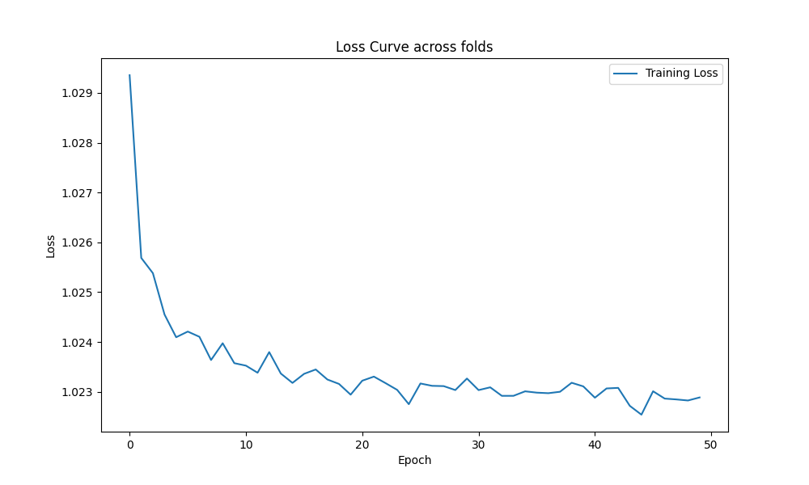

## 模型结构分析
### CNN模型
CNN模型通过一个全连接层将输入数据的维度从20映射到1024，之后通过两个卷积层进一步提取特征，最后通过一个全连接层输出三种蛋白质二级结构的预测。该模型中使用了残差连接（x = F.relu(self.conv1(x)+x)），这有助于解决深层网络中的梯度消失问题，并提升模型的学习能力。

### MLP模型
MLP模型包含三个全连接层，每个中间层后都使用ReLU激活函数进行非线性变换。该模型结构较为简单，没有卷积层或复杂的网络结构，主要用于直接从氨基酸序列的one-hot编码中学习预测蛋白质二级结构的能力。

## 结果分析

<em>图 1: MLP模型训练过程中的损失下降曲线。</em>

<em>图 2: CNN模型训练过程中的损失下降曲线。</em>

CNN Accuracy: 48.47%

MLP Accuracy: 48.41%

这两个模型在测试集上的表现相近，但都不是特别理想。几个可能的原因包括：

**模型复杂度和数据规模：** 当前的模型可能相对于任务的复杂度来说过于简单，无法充分捕捉序列和结构之间的复杂关系。同时，如果训练数据量不够大，模型的泛化能力会受到限制。

**特征表示：** 直接使用氨基酸序列的one-hot编码可能不足以表示序列之间的复杂关系。采用预训练的氨基酸嵌入向量（如使用语言模型在大规模未标记蛋白质数据库上预训练得到的）可能会提供更丰富的序列信息。

**模型结构选择：** 尽管在CNN模型中尝试使用了残差连接，但更深的网络或是其他类型的网络结构（如Transformer或更复杂的RNN变种）可能会对捕捉序列特征更有效。